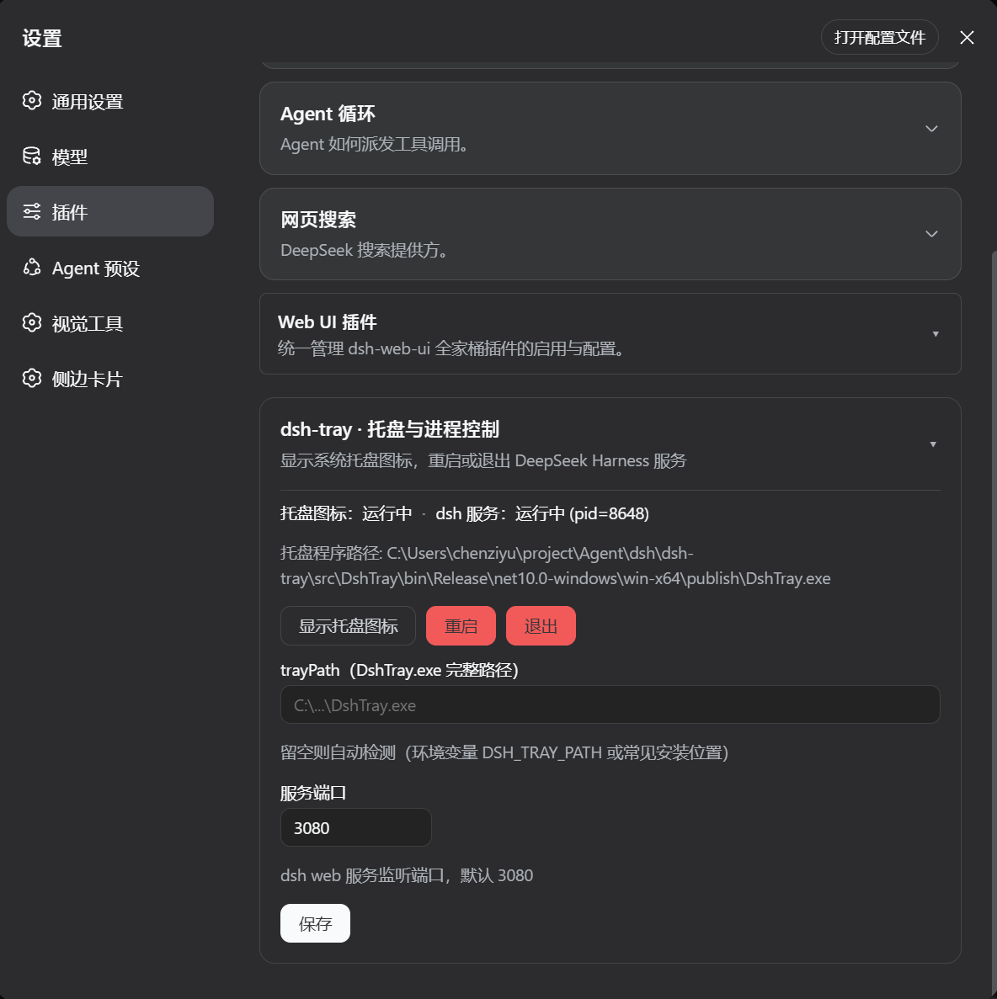

# dsh-tray

> DeepSeek Harness 的**托盘 + Web 设置插件**单一仓库：系统托盘图标（右键菜单只有 **重启 / 退出**）+
> Web 设置页里的「显示托盘图标 / 重启 / 退出」卡片。两个入口驱动同一个托盘程序，一次安装全部到位。


## 预览



## 这是什么

一个仓库包含两个组件，功能相同、入口不同：

| 组件 | 位置 | 作用 |
| --- | --- | --- |
| **托盘程序** `DshTray.exe` | `src/DshTray`（C# WinForms） | 系统托盘图标，右键菜单：**重启** / **退出** |
| **Web 设置插件** `dsh-tray-plugin` | `plugin/`（DSH 官方 SDK） | 设置 -> 插件 页面卡片：**显示托盘图标 / 重启 / 退出** + 实时状态 + 配置表单 |

两者的「重启 / 退出」都由 `DshTray.exe` 执行：按端口找到 dsh 服务进程，捕获其**命令行 + 工作目录**，
杀掉进程树后用完全相同的命令重放拉起（支持 `pnpm dsh web` / 源码 `node ... bin.ts web` / `npx @deepseek-ai/dsh` 等任意启动方式）。

## 为什么不是纯插件？

DSH 插件是进程内模块，框架没有任何原生系统托盘能力（见官方 [develop/basic](https://deepseek-harness.github.io/deepseek-harness/develop/basic/)）。
托盘图标、右键菜单是 Windows 原生外壳元素，必须由独立原生进程承载；「重启 / 退出」还需要控制宿主进程本身，
在进程内部做很别扭。因此：托盘用 C# 小程序（与 dsh-launcher 同技术栈），Web 入口用官方 SDK 插件，两者通过 `DshTray.exe` 的 CLI 协同。

## 快速安装（一键）

需要：.NET SDK 10（构建托盘）、Node.js 18+ 与 pnpm（构建插件）、已安装 dsh 并启动过目标 profile。

```powershell
powershell -ExecutionPolicy Bypass -File scripts\install.ps1          # 默认 profile: web
powershell -ExecutionPolicy Bypass -File scripts\install.ps1 -Profile web
```

脚本做四件事：

1. 构建托盘程序并把 `DshTray.exe` 复制到 `%LOCALAPPDATA%\dsh-tray\`（插件自动检测的首选位置）；
2. `pnpm install && pnpm build` 构建 `plugin/` 设置插件；
3. 把插件注册进 `~/.dsh/profiles/<profile>/package.json`（dependencies + bundles，幂等）并 `pnpm install`；
4. 提示重启。

然后**重启 dsh 服务**（托盘右键 -> 重启，或手动），浏览器硬刷新，进入 **设置 -> 插件** 即可看到卡片。

## 手动安装

```powershell
# 1. 构建托盘
powershell -File scripts\build.ps1                 # 产物: src\DshTray\bin\Release\net10.0-windows\win-x64\publish\DshTray.exe
powershell -File scripts\build.ps1 -SelfContained  # 打包完整 .NET 运行时，目标机免装

# 2. 构建插件
cd plugin && pnpm install && pnpm build            # 产物: plugin\lib\{index,routes,client}.js

# 3. 挂载到 profile（把 <仓库路径> 换成实际路径）
#    编辑 ~/.dsh/profiles/web/package.json：
#      "dependencies": { ..., "dsh-tray-plugin": "link:<仓库路径>/plugin" }
#      "dsh": { "profile": { "bundles": [ ..., "dsh-tray-plugin" ] } }
pnpm install --dir ~/.dsh/profiles/web

# 4. 重启 dsh web + 浏览器硬刷新
```

## 使用

**托盘**（直接运行 `DshTray.exe`）：

- 右键菜单恰好两项：**重启** / **退出**；双击图标打开 `http://127.0.0.1:3080`；
- 单实例；日志 `%USERPROFILE%\.dsh-tray.log`。

**Web 设置插件**（设置 -> 插件 -> dsh-tray 卡片）：

- 实时状态：托盘图标运行中/未运行、dsh 服务运行中（pid）/未运行、托盘程序路径；
- 三个按钮：**显示托盘图标** / **重启** / **退出**（重启/退出有确认弹窗，会断开当前服务）；
- 配置表单：`trayPath`（留空自动检测）+ `port`（默认 3080），保存写入 `~/.dsh/settings.yaml` 的 `dsh-tray` 段。

**托盘程序路径解析顺序**：设置项 `trayPath` → 环境变量 `DSH_TRAY_PATH` → `%LOCALAPPDATA%\dsh-tray\DshTray.exe`
→ `%ProgramFiles%\dsh-tray\DshTray.exe` → 本仓库开发检出布局。

## 目录结构

```
dsh-tray/
├── src/DshTray/           # 托盘程序（C# WinForms, net10.0-windows）
│   ├── DshTray.csproj
│   ├── Program.cs         # 托盘（重启/退出菜单）+ CLI 模式（--status/--restart/--stop）
│   ├── ServerController.cs# 找进程/识别/杀树/重放启动
│   ├── NativeMethods.cs   # CommandLineToArgvW / PEB 读工作目录
│   └── assets/favicon.png
├── plugin/                # Web 设置插件（官方 DSH SDK）
│   ├── cordis.patch.yml
│   └── src/
│       ├── index.ts       # host：settings 命名空间 + /api/dsh-tray 路由
│       ├── routes.ts      # 托盘定位 / 状态 / 动作（loopback 围栏）
│       └── client/        # browser：设置卡片（状态 + 三按钮 + 配置表单）
├── scripts/
│   ├── build.ps1          # 构建托盘
│   └── install.ps1        # 一键安装（构建托盘+插件 + 注册 profile）
└── README.md
```

## 卸载

- 托盘：删除 `%LOCALAPPDATA%\dsh-tray\DshTray.exe`；
- 插件：从 `~/.dsh/profiles/<profile>/package.json` 移除 `dsh-tray-plugin` 依赖与 bundles 条目，`pnpm install --dir ~/.dsh/profiles/<profile>`，重启 dsh；
- 可选：删除 `~/.dsh/settings.yaml` 的 `dsh-tray:` 段。

## 注意

- 「重启 / 退出」会终止 dsh 服务进程本身；重启后服务按原命令自动拉起（约 10-30 秒），当初手动启动 dsh 的终端会显示命令已结束；
- 托盘程序为框架依赖单文件，目标机需安装 .NET Desktop Runtime 10（`winget install Microsoft.DotNet.DesktopRuntime.10`）；
- `/api/dsh-tray/*` 仅限回环请求（重启/退出会终止服务本身，禁止暴露到局域网）。

## 免责声明

独立第三方工具，与 DeepSeek / DeepSeek AI 官方无关。[DeepSeek Harness](https://github.com/deepseek-ai/deepseek-harness)（`dsh`）是官方项目（MIT）。图标使用 DeepSeek 品牌标识，版权归 DeepSeek 所有，仅作个人本地使用。

## 许可证

[MIT](LICENSE)
